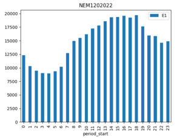
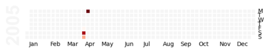

# Command Line

You can quickly output the NEM file in a more human readable format:

``` bash
nemreader output-csv "examples/nem12/nem12#S01#INTEGM#NEMMCO.zip"
```

Which outputs transposed values to a csv file for all channels:

| t_start             | t_end               | quality | evt_code | evt_desc | Q1    | E1    |
|---------------------|---------------------|----------------|------------|------------|-------|-------|
| 2004-02-01 00:00:00 | 2004-02-01 00:30:00 | A              |            |            | 2.222 | 1.111 |
| 2004-02-01 00:30:00 | 2004-02-01 01:00:00 | A              |            |            | 2.222 | 1.111 |


# Parsing Data

First, read in the NEM file:

``` python
from nemreader import NEMFile
m = NEMFile('examples/unzipped/Example_NEM12_actual_interval.csv')
nemdata = m.nem_data()
```

You can see what data for the NMI and suffix (channel) is available:

``` python
print(nemdata.header)
# HeaderRecord(version_header='NEM12', creation_date=datetime.datetime(2004, 4, 20, 13, 0), from_participant='MDA1', to_participant='Ret1')

print(nemdata.transactions)
# {'VABD000163': {'E1': [], 'Q1': []}}
```

Most importantly, you will want to get the energy data itself:

``` python
for nmi in nemdata.readings:
    for suffix in nemdata.readings[nmi]:
        for reading in nemdata.readings[nmi][suffix][-1:]:
            print(reading)
# Reading(t_start=datetime.datetime(2004, 4, 17, 23, 30), t_end=datetime.datetime(2004, 4, 18, 0, 0), read_value=14.733, uom='kWh', quality_method='S14', event='', val_start=None, val_end=None)
```

Alternatively, you can also return the data as a pandas dataframe.

``` python
from nemreader import NEMFile
m = NEMFile('examples/unzipped/Example_NEM12_actual_interval.csv')
df = m.get_data_frame()
print(df)
```

```df
           nmi suffix      serno             t_start               t_end  value quality evt_code evt_desc
0   VABD000163     E1  METSER123 2004-02-01 00:00:00 2004-02-01 00:30:00  1.111       A                  
1   VABD000163     E1  METSER123 2004-02-01 00:30:00 2004-02-01 01:00:00  1.111       A                  
2   VABD000163     E1  METSER123 2004-02-01 01:00:00 2004-02-01 01:30:00  1.111       A                  
3   VABD000163     E1  METSER123 2004-02-01 01:30:00 2004-02-01 02:00:00  1.111       A                  
4   VABD000163     E1  METSER123 2004-02-01 02:00:00 2004-02-01 02:30:00  1.111       A                  
..         ...    ...        ...                 ...                 ...    ...     ...      ...      ...
43  VABD000163     Q1  METSER123 2004-02-01 21:30:00 2004-02-01 22:00:00  2.222       A                  
44  VABD000163     Q1  METSER123 2004-02-01 22:00:00 2004-02-01 22:30:00  2.222       A                  
45  VABD000163     Q1  METSER123 2004-02-01 22:30:00 2004-02-01 23:00:00  2.222       A                  
46  VABD000163     Q1  METSER123 2004-02-01 23:00:00 2004-02-01 23:30:00  2.222       A                  
47  VABD000163     Q1  METSER123 2004-02-01 23:30:00 2004-02-02 00:00:00  2.222       A      
```


There is also an option to pivot based on the NMI suffix/channel.

``` python
df = m.get_pivot_data_frame()
print(df)
```

```df
               nmi             t_start               t_end quality evt_code evt_desc     E1     Q1
0       VABD000163 2004-02-01 00:00:00 2004-02-01 00:30:00       A                    1.111  2.222
1       VABD000163 2004-02-01 00:30:00 2004-02-01 01:00:00       A                    1.111  2.222
2       VABD000163 2004-02-01 01:00:00 2004-02-01 01:30:00       A                    1.111  2.222
3       VABD000163 2004-02-01 01:30:00 2004-02-01 02:00:00       A                    1.111  2.222
4       VABD000163 2004-02-01 02:00:00 2004-02-01 02:30:00       A                    1.111  2.222
5       VABD000163 2004-02-01 02:30:00 2004-02-01 03:00:00       A                    1.111  2.222
6       VABD000163 2004-02-01 03:00:00 2004-02-01 03:30:00       A                    1.111  2.222
7       VABD000163 2004-02-01 03:30:00 2004-02-01 04:00:00       A                    1.111  2.222
8       VABD000163 2004-02-01 04:00:00 2004-02-01 04:30:00       A                    1.111  2.222
```


# Charting

You can chart the usage data using
[pandas](https://pip.pypa.io/en/stable/quickstart/):

``` python
import matplotlib.pyplot as plt
from nemreader import output_as_data_frames

# Setup Pandas DataFrame
dfs = output_as_data_frames("examples/nem12/NEM12#000000000000002#CNRGYMDP#NEMMCO.zip")
nmi, df = dfs[0] # Return data for first NMI in file
df.set_index("t_start", inplace=True)

# Chart time of day profile
hourly = df.groupby([(df.index.hour)]).sum()
plot = hourly.plot(title=nmi, kind="bar", y=["E1"])
plt.show()
```



Or even generate a calendar with daily usage totals:

``` python
import pandas as pd
ser = pd.Series(df.E1)

import calmap
plot = calmap.calendarplot(ser, daylabels="MTWTFSS")
plt.show()
```


