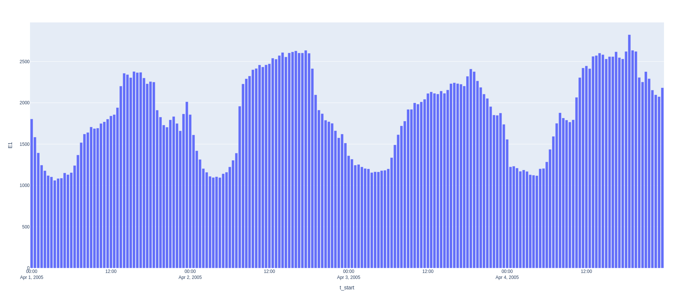

# Command Line

You can quickly output the NEM file in a more human readable format:

``` bash
nemreader output-csv "nem12#S01#INTEGM#NEMMCO.zip"
```

Which outputs transposed values to a csv file for all channels:

| t_start             | t_end               | quality_method | event_code | event_desc | Q1    | E1    |
|---------------------|---------------------|----------------|------------|------------|-------|-------|
| 2004-02-01 00:00:00 | 2004-02-01 00:30:00 | A              |            |            | 2.222 | 1.111 |
| 2004-02-01 00:30:00 | 2004-02-01 01:00:00 | A              |            |            | 2.222 | 1.111 |


# Parsing Data

First, read in the NEM file:

``` python
from nemreader import read_nem_file
m = read_nem_file('examples/unzipped/Example_NEM12_actual_interval.csv')
```

You can see what data for the NMI and suffix (channel) is available:

``` python
print(m.header)
# HeaderRecord(version_header='NEM12', creation_date=datetime.datetime(2004, 4, 20, 13, 0), from_participant='MDA1', to_participant='Ret1')

print(m.transactions)
# {'VABD000163': {'E1': [], 'Q1': []}}
```

Most importantly, you will want to get the energy data itself:

``` python
for nmi in m.readings:
    for suffix in m.readings[nmi]:
        for reading in m.readings[nmi][suffix][-1:]:
            print(reading)
# Reading(t_start=datetime.datetime(2004, 4, 17, 23, 30), t_end=datetime.datetime(2004, 4, 18, 0, 0), read_value=14.733, uom='kWh', quality_method='S14', event='', val_start=None, val_end=None)
```

Alternatively, you can also return the data as pandas dataframes (one
per NMI).

``` python
from nemreader import output_as_data_frames
dfs = output_as_data_frames('examples/unzipped/Example_NEM12_actual_interval.csv')
```

# Charting

You can chart the usage data using
[pandas](https://pip.pypa.io/en/stable/quickstart/):

``` python
import matplotlib.pyplot as plt
from nemreader import output_as_data_frames

# Setup Pandas DataFrame
dfs = output_as_data_frames("examples/nem12/NEM12#000000000000002#CNRGYMDP#NEMMCO.zip")
nmi, df = dfs[0] # Return data for first NMI in file
df.set_index("t_start", inplace=True)

# Chart time of day profile
hourly = df.groupby([(df.index.hour)]).sum()
plot = hourly.plot(title=nmi, kind="bar", y=["E1"])
plt.show()
```



Or even generate a calendar with daily usage totals:

``` python
import pandas as pd
ser = pd.Series(df.E1)

import calmap
plot = calmap.calendarplot(ser, daylabels="MTWTFSS")
plt.show()
```


